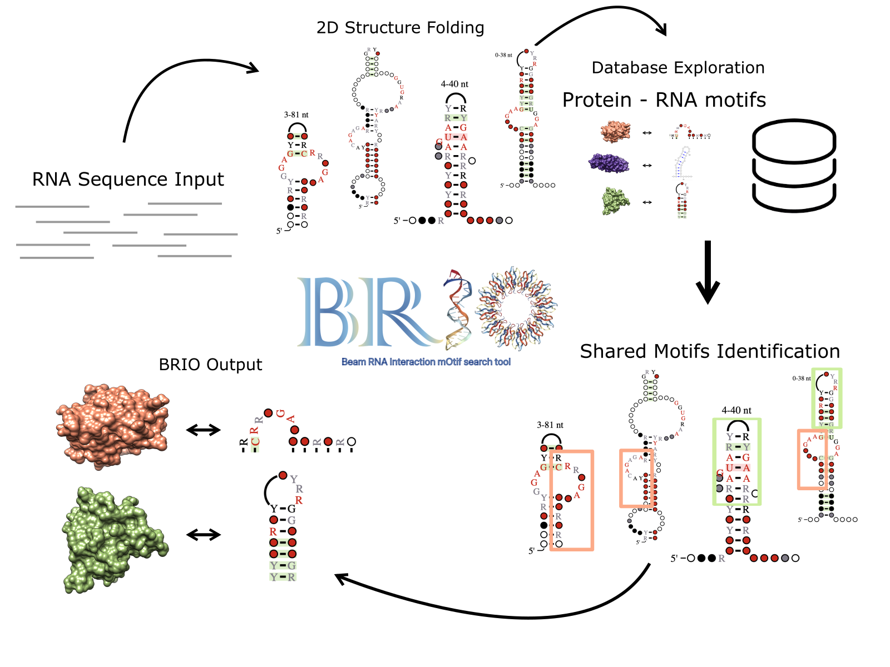

# BRIO webserver

http://brio.bio.uniroma2.it/



## Citation
Guarracino A, Pepe G, Ballesio F, Adinolfi M, Pietrosanto M, Sangiovanni E, Vitale I, Ausiello G, Helmer-Citterich M.<br/>
BRIO: a web server for RNA sequence and structure motif scan. Nucleic Acids Res ([Link](https://doi.org/10.1093/nar/gkab400)).

	
### Technical Notes

* To lunch the server in background: 
```
sudo forever start index.js 
```
 
* First time after git clone:
```
npm cache clean --force
rm -rf node_modules package-lock.json
npm install
```

* To change port:
```
change ports on index.js
first 1024 ports can only be assigned by sudoers
```
 	
* Before to put online new things

```sudo killall -9 node```


* docs
	* errorCodes : table of common error codes

* .gitignore : paths that must **NOT** be committed (like results or specific test data)

* routes
	* routes : handles request to / 
	* formRoutes : handles post requests to /go/

* scripts : python scripts and such. 

* public
	* css : contains bootstrap CSS (for now the JS is loaded via CDN)
